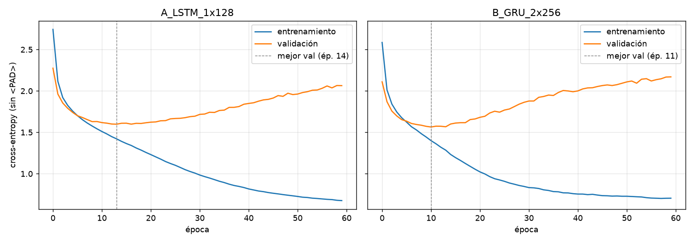

# Isla de los Dinosaurios — Laboratorio II PLN (2026 S02)

Aplicación que crea un dinosaurio ficticio en cuatro etapas encadenadas:

```
Modelo de caracteres (GRU) → Nombre → Ollama (SageMaker) → Identidad → aMUSEd → Imagen → Chat
```

**Sitio:** https://zk6dst5eom6dhbjfcivxejcpn40iakbw.lambda-url.us-east-1.on.aws/

> El sitio necesita que el notebook de SageMaker `ollama` esté encendido (ahí corren
> Ollama y el generador de imágenes). `GET /api/estado` dice si cada pieza responde.

## Estructura

| Carpeta | Qué hay | Cómo se ejecuta |
|---|---|---|
| `1_generador_nombres/` | Preprocesamiento, entrenamiento LSTM vs GRU, curvas, muestreo y los 10 nombres. `data/dinos.csv` es el dataset del laboratorio. | `python entrenar.py` (CPU, ~1,5 min). Salidas en `resultados/`. |
| `2_ollama_sagemaker/` | Lifecycle script `on-start.sh`, notebook de verificación `identidad_ollama.ipynb` y el prompt de identidad. | Ver sección 2. |
| `3_imagen/` | `colab_imagen.ipynb` (GPU en Colab), `servidor_imagen.py` (mismo código como API) y su `Dockerfile` para el notebook. | Colab: abrir el notebook y ejecutar. Servidor: lo levanta `on-start.sh`. |
| `4_app/` | Lambda `dino-app` (página web + orquestador) y `deploy.sh`. | `./4_app/deploy.sh` |

Dependencias locales: `pip install -r requirements.txt` (PyTorch CPU basta).

---

## 1. Generador de nombres

### Preprocesamiento
1. **Normalización:** minúsculas, sin tildes, solo `a-z` → 1524 nombres únicos.
2. **Vocabulario:** `<PAD>`=0, `<BOS>`=1, `<EOS>`=2 y las 26 letras (29 tokens).
3. **Tokens especiales:** cada nombre queda `<BOS> c1 … cn <EOS>`.
4. **Longitud máxima:** la secuencia más larga mide 28 tokens, así que **T = 27**.
5. **Relleno:** las secuencias cortas se completan con `<PAD>` hasta T+1.
6. **Entrada/objetivo:** `X = [x0 … x_{T-1}]`, `Y = [x1 … x_T]` (desplazamiento de un carácter).

Partición 90/10 con semilla fija: 1372 nombres de entrenamiento y 152 de validación.
El detalle (con un ejemplo de X/Y) queda en `resultados/preprocesamiento.json`.

### Configuraciones evaluadas

| | A | B |
|---|---|---|
| Celda | LSTM | GRU |
| Capas × estado oculto | 1 × 128 | 2 × 256 |
| Embedding | 32 | 48 |
| Dropout | 0 | 0,3 |
| Épocas | 60 | 60 |
| Pérdida | CrossEntropy con `ignore_index=<PAD>` | igual |
| Optimizador | Adam, lr 3e-3, batch 64, clip 5 | Adam, lr 2e-3, batch 64, clip 5 |
| Parámetros | 87 613 | 638 605 |
| **Mejor pérdida de validación** | 1,598 (época 14) | **1,564 (época 11)** |
| Pérdida final train / val (época 60) | 0,676 / 2,064 | 0,705 / 2,170 |



**Lectura de las curvas.** Con solo ~1400 nombres, ambos modelos dejan de generalizar
pronto: la validación toca su mínimo entre las épocas 11 y 14 y luego sube mientras el
entrenamiento sigue bajando (memorizan el dataset). Por eso se guarda el estado de la
**mejor época de validación** (early stopping), no el de la última. La GRU más grande
llega a un mínimo algo mejor y antes, pero también sobreajusta más rápido. Se usa la
**configuración B** para el resto del laboratorio.

### Muestreo
200 nombres por estrategia con el modelo B:

| Estrategia | % nuevos (no en el dataset) | % únicos | Largo medio | % terminan en -saurus/-raptor/-don/-ops |
|---|---:|---:|---:|---:|
| T = 0,5 | 86,5 | 88,0 | 11,6 | 83,0 |
| T = 1,0 | 98,0 | 99,5 | 11,6 | 67,5 |
| T = 1,5 | 100 | 100 | 12,7 | 32,5 |
| top-k = 5 (T = 1,0) | 95,5 | 99,0 | 12,0 | 74,5 |
| top-p = 0,9 (T = 1,0) | 97,0 | 100 | 11,8 | 70,5 |

- **T = 0,5** es muy conservadora: 13 % de los nombres son copias de dinosaurios reales y casi todos terminan en *-saurus*.
- **T = 1,5** es totalmente nueva pero pierde la forma de nombre: `cosshadrkvecatitansconnus`, `yonfwanis`.
- **top-k = 5** quita las letras raras pero puede cortar opciones válidas en posiciones con muchas alternativas.
- **top-p = 0,9** da el mejor equilibrio: 97 % nuevos, 100 % únicos y sufijos reconocibles; se adapta a cada posición (pocas opciones al cerrar *-saurus*, más al inicio del nombre). **Es la estrategia que usa la app.**

### Diez nombres nuevos (top-p 0,9) — ninguno está en `dinos.csv`

Nexiniania · Limedsaurus · Mellodon · Chistropheus · Neotosaurus · Gitecosaurus · Ichanodon · Enchurosaurus · Brachyraptor · Paeuancousaurus

Se repiten raíces reales (*-saurus*, *-odon*, *-raptor*, *brachy-*, *neo-*) en combinaciones que no
existen; algunos (Nexiniania, Paeuancousaurus) son menos convincentes. **Seleccionado: `Limedsaurus`**
(primer nombre con sufijo clásico, corto y pronunciable).

### Exportación
`entrenar.py` guarda el mejor modelo en `modelo.pt` y además en `modelo_npz.npz` + `modelo_meta.json`.
La app no usa PyTorch: `4_app/lambda/dino_rnn.py` reimplementa la GRU en numpy y da los mismos
logits que PyTorch (diferencia máxima 4e-6). **"Nuevo dinosaurio" solo muestrea del modelo ya
entrenado; nunca reentrena.**

---

## 2. Identidad con Ollama en SageMaker

| | |
|---|---|
| Notebook | `ollama`, `ml.m5.xlarge` (4 vCPU, 16 GB), disco 90 GB, rol `LabRole` |
| Ollama | contenedor `ollama/ollama` (CPU), puerto 11434 |
| Modelo | **`gemma4:e2b`**, digest `b37049369adf`, 4.6B parámetros, GGUF Q4_K_M (consultable en `GET /api/estado` o en `identidad_ollama.ipynb`) |
| Lifecycle | `lab-dinos-on-start` → `2_ollama_sagemaker/on-start.sh` |

**Persistencia.** SageMaker solo conserva `/home/ec2-user/SageMaker` entre reinicios. El script
`on-start.sh` (lifecycle *on-start*, corre como root en cada arranque):
1. pone `"data-root": "/home/ec2-user/SageMaker/docker"` en `/etc/docker/daemon.json` y reinicia Docker;
2. guarda los modelos de Ollama en `/home/ec2-user/SageMaker/ollama` y la caché de Hugging Face en `/home/ec2-user/SageMaker/hf`;
3. arranca (o crea) el contenedor de Ollama;
4. en segundo plano (el lifecycle tiene límite de 5 min): `ollama pull gemma4:e2b` (solo descarga la primera vez) y construye/levanta el contenedor del servidor de imagen.

Crear/actualizar el lifecycle:
```bash
aws sagemaker create-notebook-instance-lifecycle-config \
  --notebook-instance-lifecycle-config-name lab-dinos-on-start \
  --on-start Content=$(base64 -w0 2_ollama_sagemaker/on-start.sh)
aws sagemaker update-notebook-instance --notebook-instance-name ollama \
  --lifecycle-config-name lab-dinos-on-start      # con el notebook detenido
```

**Identidad.** El prompt (`prompt_identidad.txt`) da al modelo raíces reales (*-saurus* lagarto,
*-raptor* ladrón, *-odon* diente, *-venator* cazador, *-ceratops*, *-onyx*…) y pide un JSON con
significado del nombre, periodo, tamaño, apariencia, hábitat, alimentación, comportamiento, rasgo
distintivo, un párrafo de descripción y un `prompt_imagen` en inglés para la etapa siguiente.
Se usa `format: "json"` de Ollama y se reintenta si falta alguna clave.

Identidad obtenida para **Limedsaurus**: depredador del Jurásico Tardío, 15 m y 5 t, piel gris
pizarra con placas óseas y una cresta en la cabeza que usa para intimidar; vive en llanuras
pantanosas y caza reptiles y mamíferos acuáticos. Completa en `2_ollama_sagemaker/identidad_limedsaurus.json`.

---

## 3. Imagen

- Modelo: **`amused/amused-512`** (aMUSEd, 512×512, 12 pasos, guidance 10, semilla 7).
- `3_imagen/colab_imagen.ipynb`: versión Colab con GPU T4 (fp16).
- `3_imagen/servidor_imagen.py`: el mismo código como API (`POST /generar`). En la app desplegada corre
  en el notebook de SageMaker en CPU (~40 s por imagen; ~100 s la primera, mientras carga el modelo), así la app no depende de tener Colab abierto.
- Prompt = `"<Nombre>, a dinosaur. " + prompt_imagen` (rasgos de Ollama), corto como pide la guía.


---

## 4. Aplicación web

Una sola Lambda (`dino-app`, Python 3.12, Function URL pública) sirve la página y orquesta las
llamadas. El notebook no tiene IP pública: la Lambda pide una URL prefirmada del notebook con
`LabRole` y entra por su proxy interno `/proxy/<puerto>/`. No se usa ngrok ni servicios externos.
Los dinosaurios (JSON) y sus imágenes se guardan en un bucket S3 **privado** (`dino-lab-…`);
las imágenes se sirven a través de la Lambda.

```
Navegador ──► Lambda dino-app ──► GRU en numpy (nombre)
                    │
                    ├──► notebook SageMaker /proxy/11434 ──► Ollama gemma4:e2b
                    ├──► notebook SageMaker /proxy/8000  ──► aMUSEd (servidor_imagen.py)
                    └──► S3 privado: dinos/<id>.json, img/<id>.png
```

### Qué recibe y devuelve cada componente

| Componente | Recibe | Devuelve |
|---|---|---|
| `POST /api/nombre` (GRU numpy) | `{}` | `{nombre, modelo:{arquitectura, parametros, val_loss, …}}` |
| `POST /api/identidad` → Ollama `/api/chat` | `{nombre}` | `{id, nombre, identidad:{significado_nombre, periodo, tamano, apariencia, habitat, alimentacion, comportamiento, rasgo_distintivo, descripcion, prompt_imagen}, modelo_ollama}` |
| `POST /api/imagen` → servidor `/generar` | `{id}` | `{id, imagen_url, segundos, modelo_imagen, dispositivo}`. Si el dinosaurio ya tiene imagen, la reutiliza. |
| servidor de imagen `POST /generar` | `{prompt, seed, pasos}` | `{png_base64, segundos, modelo, dispositivo}` |
| `POST /api/chat` → Ollama `/api/chat` | `{id, mensajes:[{role, content}]}` | `{respuesta, imagen_url \| null, presentacion}` |
| `GET /api/dino/actual`, `/api/dino/<id>` | — | registro completo del dinosaurio |
| `GET /img/<id>.png` | — | la imagen (PNG) |
| `GET /api/estado` | — | estado del notebook, modelos de Ollama y servidor de imagen |

### Chat
- Cada petición manda a Ollama un *system prompt* con la identidad guardada en la etapa 2 y la regla de no contradecirla (puede ampliar detalles coherentes).
- Al abrirse, el dinosaurio se presenta **con su imagen**. Si el usuario pide su descripción ("descríbete", "¿cómo eres?", "muéstrate", "¿quién eres?"…) la respuesta vuelve a incluir la imagen.
- La imagen se genera una sola vez por dinosaurio y se reutiliza.
- Prueba de coherencia: a "¿Es verdad que eres herbívoro?" Limedsaurus responde que es carnívoro y caza reptiles y mamíferos acuáticos.

### Nuevo dinosaurio
El botón repite nombre → identidad → imagen → presentación usando el modelo ya entrenado
(sin reentrenar). Con el notebook en CPU tarda ~2 min: ~1 min la identidad y ~45 s la imagen.
Cada respuesta del chat tarda ~20 s. Ollama se llama con `think: false`: Gemma 4 razona antes de
responder y, en CPU, eso duplicaba la latencia y se comía el límite de tokens (respuestas vacías).

### Despliegue
```bash
aws configure          # credenciales del Learner Lab (nunca en el repo)
./4_app/deploy.sh      # empaqueta numpy + modelo + página y crea/actualiza la Lambda
```

---

## Seguridad
- El repositorio no contiene credenciales, claves ni tokens; AWS se configura con `aws configure`.
- El bucket S3 es privado; solo la Lambda lee y escribe.
- La Lambda valida entradas (id con regex, nombres solo letras, mensajes recortados a 1000 caracteres y 12 turnos).
